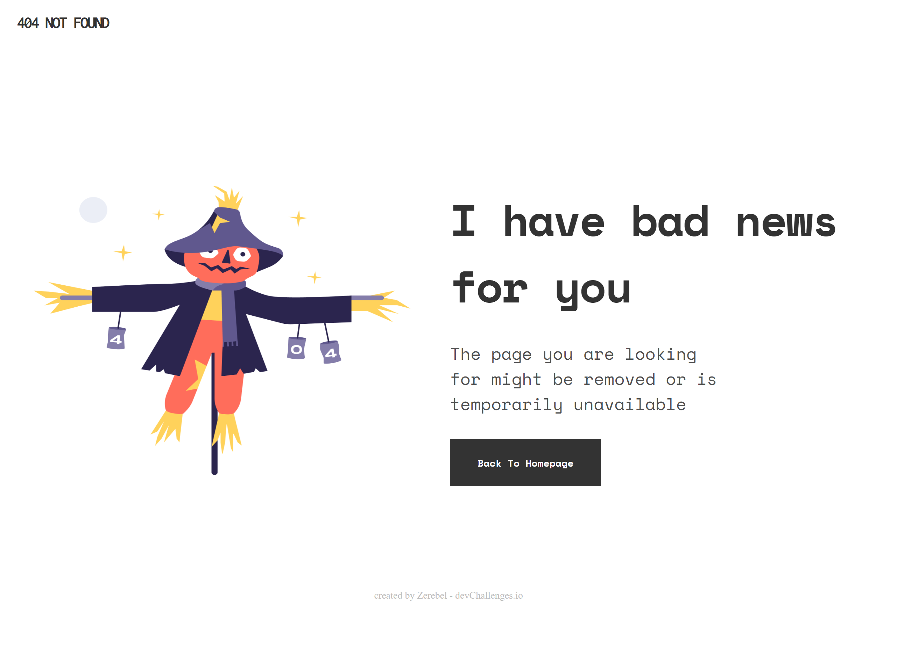

<!-- Please update value in the {}  -->

<h1 align="center">404-page-not-found</h1>

   Solution for a challenge from  <a href="http://devchallenges.io" target="_blank">Devchallenges.io</a>.

  <h3>
    <a href="https://zerebel.github.io/devChallenges.github.io/">
      Demo
    </a>
     | 
    <a href="https://devchallenges.io/solutions/mizoKVR4AHLCFMLF9cEr">
      Solution
    </a>
     | 
    <a href="https://devchallenges.io/challenges/wBunSb7FPrIepJZAg0sY">
      Challenge
    </a>
  </h3>

<!-- TABLE OF CONTENTS -->

## Table of Contents

- [Overview](#overview)
- [Built With](#built-with)
- [Features](#features)
- [Contact](#contact)

<!-- OVERVIEW -->

## Overview

A 404 not found page created with HTML and CSS only

Demo URL: https://zerebel.github.io/devChallenges.github.io/

### Built With

<!-- This section should list any major frameworks that you built your project using. Here are a few examples.-->

-HTML and CSS only

## Features

<!-- List the features of your application or follow the template. Don't share the figma file here :) -->

This application/site was created as a submission to a [DevChallenges](https://devchallenges.io/challenges) challenge. The [challenge](https://devchallenges.io/challenges/wBunSb7FPrIepJZAg0sY) was to build an application to complete the given user stories.

## Contact

- Website [your-website.com](...)
- GitHub [@your-username](https://github.com/Zerebel)
- Twitter [@your-twitter](https://{twitter.com/your-username})
